# ZitAuth 🛡️ ✨

ZitAuth is a centralized authentication gateway that transforms Zitadel integration from a headache into a breeze. One clean API for all your apps—web, mobile, and backend services.

**Why ZitAuth?** Because your applications shouldn't care about JWT validation, JWKS endpoints, or OIDC flows. They should just work.

## ✨ Key Features

🔐 **Bulletproof User Authentication**: OIDC login with PKCE flow  
🤖 **Effortless Service-to-Service Auth**: M2M authentication with JWT Bearer Grant  
✅ **One-Stop Token Validation**: Single `/validate` endpoint handles all tokens  
🎯 **Ready-to-Run Examples**: Complete user and machine authentication simulation     
🐍 **Dual Implementation**: Available in both Python (FastAPI) and Node.js (Express)   

## 📊 Architecture Diagram

```mermaid
graph TD
    subgraph "Clients"
        User[👤 User]
        M2MClient[💻 Backend Service]
    end

    subgraph "Application Layer"
        SPA[🌐 SPA / Web App]
        ProtectedAPI[📦 Your Protected API]
    end

    subgraph "Authentication Core"
        ZitAuth[🛡️ ZitAuth Gateway]
        Zitadel[🔐 Zitadel IdP]
    end

    %% User Authentication Flow
    User -- "Initiates Login" --> SPA
    SPA -- "Redirects for Auth" --> ZitAuth
    ZitAuth -- "Handles OIDC Flow" --> Zitadel
    Zitadel -- "Authenticates & Issues Code" --> ZitAuth
    ZitAuth -- "Exchanges Code for Token" --> Zitadel
    ZitAuth -- "Returns Token" --> SPA
    SPA -- "Calls API with User Token" --> ProtectedAPI

    %% M2M Authentication Flow
    M2MClient -- "Requests M2M Token" --> ZitAuth
    ZitAuth -- "Handles JWT Bearer Grant" --> Zitadel
    Zitadel -- "Issues M2M Token" --> ZitAuth
    ZitAuth -- "Returns Token" --> M2MClient
    M2MClient -- "Calls API with M2M Token" --> ProtectedAPI

    %% Centralized Validation
    ProtectedAPI -- "Validates Token via Gateway" --> ZitAuth
```



## 🚀 Quick Start

### Prerequisites

- Docker and Docker Compose
- Python 3.11+
- `pip` for installing dependencies

### Step 1: Set Up the Zitadel Environment

  - The provided `docker-compose.yaml` file is used to set up a local Zitadel instance. You can also use Zitadel hosted on the cloud.

    ```bash
    docker compose up -d
    ```

  - You can access the Zitadel Console at `http://localhost:8080`.

### Step 2: Configure Zitadel

- After starting Zitadel, log in to the console at http://localhost:8080 using these creds:
  - username: `zitadel-admin@zitadel.localhost`
  - password: `Password1!`

- You will need to create a project and application within it (for mobile login flow) and a service user (for m2m flow) and configure login policies (Required for User registration)

  <details>
  <summary>Click to expand Zitadel Application Configuration</summary>

  - In your project, create a new application of type `User Agent`
  - Select authentication method as `PKCE`, toggle the `Development mode` to allow redirect to http 
  - Configure the redirect URI as `http://localhost:8000/api/v1/callback`
  - After creating the application, Go to the `Token Settings` tab and select `Auth Token Type` as `JWT`
  - Go to the URLs tab and note down the urls and client id in .env file

  </details>

  <details>
  <summary>Click to expand Zitadel Service User Configuration</summary>

  - In the Zitadel console, go to `Users` Section and then to the `Service Users` tab
  - Click on the `New` button
  - Fill basic details and select the `Access Token Type` as `JWT`
  - Go to `Keys` tab and add a new key of type `JSON` and download it
  - Save this file to a secure location in your project. Provide the path to this file in the `.env` file

  </details>  

  <details>
  <summary>Click to expand Zitadel Login Policy Configuration</summary>
  - Navigate to the `Default Settings` setion on the zitadel console
  - Go to the `External Links` tab in the `Other` subsection
  - Configure `Link to Terms of Service` and `Link to Privacy Policy` (or use any dummy links for demo)
  - Click `Save`
  </details>

### Step 3: Configure the ZitAuth Service

1. **Create the `.env` file** by copying the example:
   ```bash
   cp .env.example .env
   ```

2. **Edit the `.env` file:**
   - Fill the environment variables with the information received from the step before

3. **Install dependencies:**
   ```bash
   pip install -r requirements.txt
   ```

## 🏃 Running the Services

The `start.sh` script is provided to run the main components. You can inspect the script to see the individual commands.

**Start the main services:**
```bash
# This will start ZitAuth on port 8000
uvicorn python.main:app --reload --port 8000
```

Note - For running in nodejs, refer to `nodejs/README.md`

## 🛠️ Testing

### Testing the User Login Flow (SPA)


1. **Start the SPA app:**
   ```bash
   uvicorn examples.spa_app.main:app --reload --port 3001
   ```

2. Open your browser and navigate to the SPA at **`http://127.0.0.1:3001`**

3. Click the **"Login via ZitAuth"** button. You will be redirected to the Zitadel login page

4. Log in with a user or register one

5. After a successful login, you will be redirected back to the SPA, and the status will show "Access token received"

6. Click `Call Protected Endpoint` and `Fetch User Info` to test the authenticated API calls

### Testing the Machine-to-Machine (M2M) Flow

1. Ensure the main services (ZitAuth Gateway and SPA App) are running

2. In a **new terminal**, run the M2M simulation script:
   ```bash
   python examples/m2m_sim.py
   ```

3. Observe the logs. The script will request an M2M token, receive it, and use it to successfully call the protected API

## 🏗️ Project Structure:
```
.
├── docker-compose.yaml     # Sets up Zitadel server locally
├── examples/
│   ├── m2m_sim.py          # Simulates the local service (M2M)
│   └── spa_app/            # Simulates the mobile/web application
├── python/
│   ├── client.py           # The core ZitadelClient abstraction layer
│   ├── main.py             # The FastAPI service (ZitAuth Gateway)
│   └── utils.py            # Helper functions
├── .env.example            # Template for environment variables
├── requirements.txt        # Python dependencies
└── start.sh                # Helper script to run services
```

## ⚙️ API Documentation

<details>
<summary><strong>Click to expand API Endpoint Documentation</strong></summary>

---

### `GET /api/v1/login`

Initiates the OIDC user login flow. This endpoint is intended to be used by a browser, which will be redirected.

- **Description:** Starts the user authentication process by redirecting the user to the Zitadel login page
- **Request:** No parameters or headers required
- **Response (Success):**
  - `HTTP 302 Found`: A redirect to the Zitadel authorization endpoint
- **Response (Error):**
  - `HTTP 400 Bad Request`: If there is an internal error generating the login URL

---

### `GET /api/v1/callback`

Handles the OIDC callback from Zitadel after a user authenticates. This endpoint is used by the browser as part of the redirect flow.

- **Description:** Zitadel redirects the user's browser to this endpoint after a successful login. The endpoint exchanges the received authorization `code` for an access token
- **Request:**
  - **Query Parameters:**
    | Parameter | Description |
    | :--- | :--- |
    | `code` | The authorization code issued by Zitadel |
    | `state` | The unique state string used to prevent CSRF attacks |
- **Response (Success):**
  - `HTTP 302 Found`: Redirects the user's browser back to the SPA (`SPA_ORIGIN`), with the `access_token` included in the URL hash fragment
- **Response (Error):**
  - `HTTP 400 Bad Request`: If the `state` is invalid, expired, or the token exchange fails

---

### `GET /api/v1/m2m-token`

Issues a machine-to-machine (M2M) access token using a pre-configured service account.

- **Description:** Allows a trusted backend service to acquire an access token by handling the JWT Bearer Grant flow on behalf of the service
- **Request:** No parameters or headers required. The service authenticates itself by its ability to call this endpoint
- **Response (Success):**
  - `HTTP 200 OK`
  - **Body (JSON):**
    ```json
    {
      "access_token": "ey..."
    }
    ```
- **Response (Error):**
  - `HTTP 500 Internal Server Error`: If the service account file is misconfigured or Zitadel rejects the request

---

### `GET /api/v1/validate`

Validates an access token and returns the authentication status.

- **Description:** A centralized endpoint for any service to delegate token validation. It checks the token's signature against Zitadel's public keys using its JWKS endpoint
- **Request:**
  - **Headers:**
    | Header | Description |
    | :--- | :--- |
    | `Authorization` | **Required.** The bearer token. Must be in the format `Bearer <token>` |
- **Response (Success):**
  - `HTTP 200 OK`
  - **Body (JSON):** The decoded claims (payload) of the JWT
    ```json
    {
      "sub": "1234567890",
      "name": "John Doe",
      "iat": 1516239022,
      "exp": 1516242622,
      "iss": "http://localhost:8080"
    }
    ```
- **Response (Error):**
  - `HTTP 400 Bad Request`: If the `Authorization` header is missing or malformed
  - `HTTP 401 Unauthorized`: If the token is invalid (expired, bad signature, etc.)

---

### `GET /api/v1/userinfo`

Fetches the user profile from Zitadel's userinfo endpoint using a valid access token.

- **Description:** Acts as a secure proxy to Zitadel's userinfo endpoint
- **Request:**
  - **Headers:**
    | Header | Description |
    | :--- | :--- |
    | `Authorization` | **Required.** The bearer token. Must be in the format `Bearer <token>` |
- **Response (Success):**
  - `HTTP 200 OK`
  - **Body (JSON):** The user profile information
    ```json
    {
      "userinfo": {
        "sub": "1234567890",
        "name": "John Doe",
        "email": "john.doe@example.com",
        "email_verified": true
      }
    }
    ```
- **Response (Error):**
  - `HTTP 400 Bad Request`: If the `Authorization` header is missing
  - `HTTP 401 Unauthorized`: If the access token is invalid or does not have the required scopes

</details>


# 📚 References:
- [YouTube guide for setting up Zitadel](https://youtu.be/5THbQljoPKg?si=QkEaKagDfMxn3kHb)
- [Zitadel API documentation](https://zitadel.com/docs/apis/openidoauth/endpoints)
